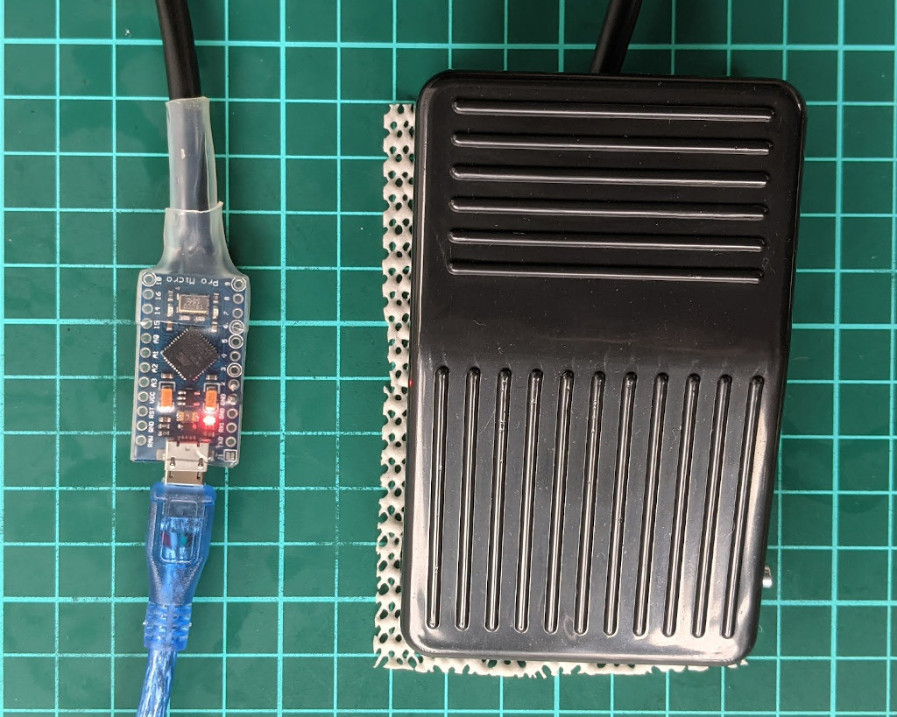

# footswitch

> Free up your hands, and your keybinds -- PTT with your foot!

`footswitch` is a 1-key keyboard for push-to-talk in Discord (and other voice-chat apps), based on [Arduino][], that you can build yourself.



## Parts list

* **An Arduino (ATmega32U4 strongly recommended).**

  Small Arduino boards based on ATmega32U4 without headers, such as the [Arduino Micro][] are best, because this gives you the most options. Similar third-party boards based on the ATmega32U4 like [Adafruit's ItsyBitsy 32U4][adafruit] and [SparkFun Pro Micro][] should also work.

  _Avoid_ the serial-only boards that have a USB-TTL chip (eg: CH341, FT232R, PL2303) because they only work as a USB serial device, require drivers and a client to simulate keypresses (which [doesn't work reliably on macOS](#macos-notes)).

  Arduino boards that _only_ support "USB programming" _won't work at all_. This only affects some old, third-party boards.

* **A foot / pedal switch.**

  This should have two or three wires, and close the circuit when the switch is pressed.

  The switch needs to be rated to at least 5V 40mA.
  
  Using a higher rated switch (eg: 240V 10A) is fine, and probably mechanically-ideal for something you're going to push with your foot!

* **Clear heat-shrink (optional).**

  If you have a small Arduino board without pin headers, you can wrap it with clear heat shrink to prevent it shorting on things.

  You'll also need a **heat gun**, **butane torch** or **lighter** to melt the heatshrink.

  Tip: heatshrink sizes are the circular diameter of the heatshrink. When laid flat (to go over a board), this is about half the circumference (ie: `W = D * π / 2`) – so 16mm heatshrink is about 25mm wide!

If you _don't_ have a **soldering iron**, you'll need to get a board with headers, and a switch with appropriate connectors.

## Wiring the board

Wiring is identical for both versions of the code, a normally-open foot switch between `D2` and `GND`:

```
                   ╔═════════╗
  ┌─ COM ──────── D2         ║
  ●                ║         USB
 ╱                 ║ Arduino ║
╱                  ║  Board  ║
  ●                ║         ║
  └─ N/O ─────── GND         ║
Switch             ╚═════════╝
```

The software uses the Arduino's [internal pull-up resistor][digital-pins] on `D2`, so you don't need to wire any additional external resistor.

You could connect the foot switch using jumper leads, solder its leads directly to the board, or add your own connector (eg: RCA).

For smaller boards, once soldered up, you can wrap the board in clear heat-shrink, to avoid it shorting on other things.  Just cut a hole for the board's reset button!

## Arduino code

Building and uploading the Arduino code requires the [Arduino IDE][Arduino].

There are two versions of the code, which are in subdirectories of this repository:

Version    | Arduino support                      | USB device class      | Serial client
---------- | ------------------------------------ | --------------------- | ----------------
`keyboard` | [ATmega32U4 and SAMD only][keyboard] | HID keyboard + serial | optional
`serial`   | Any Arduino with serial              | USB serial            | required

1. Connect your Arduino board for the footswitch to your computer via USB.

2. For safety, temporarily disconnect any _other_ Arduino boards (or USB serial devices) you have connected to your computer.

3. Open `keyboard/keyboard.ino` or `serial/serial.ino` in the Arduino IDE.

4. In Arduino IDE's `Tools` menu, select the correct `Board`, `Processor` and (serial) `Port`.

   If using a third-party board, you might need to install a package using `Board Manager` -- check the manufacturer's website for instructions.

   Uploading using the _wrong_ settings might appear to upload correctly, but then the device may not show up anymore, and require a reset and re-flash to correct.  See the manufacturer's website for instructions if this happens to you.

5. Press the `Upload` button (or `Sketch` → `Upload`).

### keyboard version

* **Arduino support**: ATmega32U4 and SAMD-based boards which support the [USB Keyboard Library][keyboard].
* **Serial client**: optional
* **OS support**: any that supports USB HID keyboards and USB CDC ACM.

This version acts as a real USB HID keyboard device, so doesn't require any "client" running on your computer to work.

It _also_ exposes a USB serial device (CDC ACM) which _can_ work with the serial version's client.

The first time you use the device on macOS, [Keyboard Set-up Assistant][] will pop up.  Press any key on _any_ keyboard to skip the auto-detection process, and then set the keyboard type to `ANSI`.

### serial version

* **Ardiuno support**: Any that provide a serial connection.
* **Serial client**: required
* **OS support**: macOS ([see notes](#macos-notes)), Windows

**This requires a "client" to work** -- this is a Python script that runs on your computer, and listens to the Arduino's serial port for button press and release events. Whenever it gets one, it simulates a keypress event, as if you pressed a key on a real keyboard.

#### macOS notes

Using simulated keypresses (for the serial version) requires access to `Accessibility` APIs (`System Preferences` -> `Privacy` -> `Accessibility`).

Discord for macOS **does not** support using simulated keypresses to trigger hotkeys. This is because Discord captures global hotkeys in a way that _doesn't_ support accessibility APIs. :(

Most other applications support simulated keypresses, so will work fine.

## Setting up Discord

Both versions use <kbd>F13</kbd> as its default key bind.

In Discord:

1. Open settings
2. Click `Voice & Video` (under `App Settings`)
3. Set `Input mode` to `Push to Talk`
4. Click `Edit keybind`
5. Press the footswitch

At this point, the shortcut should show up as `F13`.

## License and acknowledgements

Code for the Arduino (`.ino` files) is based example code from the Arduino open source project, released into the public domain. The modified Arduino code used in this project may be used under the same terms, [Creative Commons Zero 1.0][CC0], or the Apache 2.0 license (at your choice).

All other files, including the "clients", are released under the Apache 2.0 license.

[adafruit]: https://www.adafruit.com/product/3677
[Arduino]: https://www.arduino.cc/
[Arduino Micro]: https://store.arduino.cc/usa/arduino-micro-without-headers
[CC0]: https://creativecommons.org/publicdomain/zero/1.0/
[digital-pins]: https://www.arduino.cc/en/Tutorial/Foundations/DigitalPins
[keyboard]: https://www.arduino.cc/reference/en/language/functions/usb/keyboard/
[Keyboard Set-up Assistant]: https://support.apple.com/en-au/guide/mac-help/mchlp2886/mac
[SparkFun Pro Micro]: https://www.sparkfun.com/products/12587
